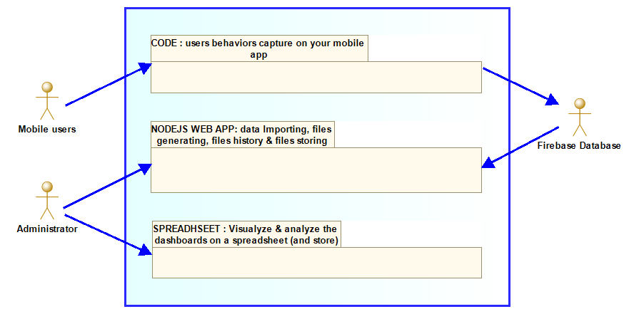
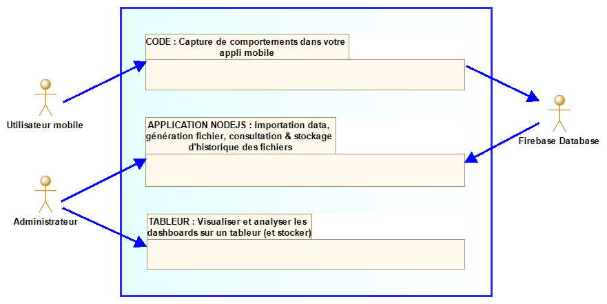

### English </img>

# I.	Disclaimer & intellectual property

1. Disclaimer : The collected data of user behaviors inside your application/applications should be anonymized to preserve the privacy of your users. In the way to improve the relationship of trust with your users, we advice you to display an information message (e.g. in section “credits”) about this collecting in your application/applications.

2. License: The application is distributed under MIT license (See LICENCE.MD).

3. Credits of images files
- file.svg : Icons made by [iconixar](https://www.flaticon.com/authors/iconixar) from [www.flaticon.com](https://www.flaticon.com)
- unknown-document.svg - Icons made by [Freepik](https://www.flaticon.com/authors/freepik) from [www.flaticon.com](https://www.flaticon.com/)
- favicon.ico - Icon made by Andrew Fitzsimon: [spreadsheet](https://openclipart.org/detail/25524/spreadsheet)

# II. Purpose of this project
## A. Goal
**The project was born from this main concept** : In webmarketing language, the primary purpose of data tracking is to collect data about the 
**users behaviors data** (so-called non-declarative or inferred data) from a First Party source (source constituting data collected by yourself).

## B. The structure of the app is based on this pattern
1.	FIREBASE DATABASE ACCOUNT TO COLLECT DATA : All user behavior data are stored on an unique remote Firebase database. Additionally: With some effort to coding you’ll can adapt your own data fields.
2.	CODE SNIPPET INSERTED IN YOUR APP MOBILE’S CODE TO TRACK THE USER’S BEHAVIORS: One mobile app sends the collected data to the remote database.
Finally you’ll visualize and analyze the dashboards to discover everything you wanted to know about your users’ behavior !
3.	GENERATE, DOWNLOAD & STORE HISTORY OF THE CSV-FORMATED-TEXT FILE : Through the app of NodeJs server, you’ll generate for the wanted duration (day relative) a CSV-formated text to import in your favorite spreadsheet exploiting the provided worksheet of the solution. Then you’ll  define your tables & diagrams adapting the providerd example according to your data quantity (how many months ?). 

</img>

**Benefits:** this architecture doesn’t need to access any Cloud server to store data, nor to have internet access to visualize and analyze your dashboards..
**Downsides:** Administrator will use two different softwares to use the application, a web browser and a spreadsheet.

# III. Client-server architecture
The design pattern is near of [MVC](https://en.wikipedia.org/wiki/Model%E2%80%93view%E2%80%93controller) (Modele View Controler). The library used with ExpressJs to show the View is [EJS](https://ejs.co/). The client-side interface technology to request the server is Ajax.
The request are explained below: 
- To write or read the settings data (using [https://www.npmjs.com/package/node-localstorage](node-localstorage) library to read & write simply the data which are file based) : to edit the connection parameters to Firebase Database.
- To import data by requesting a Firebase Database, according to a custom range of dates defined by the user.
- To generate some CSV-formatted-text files (from the freshly imported data)
- To download some CSV-formatted-text files (ALL of the files are remained stored in the server)

# IV.Installation
1. You must firstly set these two constants categories:
- Set the constants concerning the server filesystem (Unix or Windows) : set in "/.env" (all constants)
- Set the administrator preferences : set in "/src/config/config-constants.js" (sections LINGUISTIC CHOICES et CSV-TEXT FILE CHOICES)
2. Tune the Firebase Database access (excepting if you want to try app with a unique mock dataset)
- Go to the Firebase Database console, then download the credential file "serviceAccountKey.json", then push it on the "/assets/" folder (CF https://firebase.google.com/docs/database/admin/start#node.js_1)
- Complete your Firebase DB account ids on the <em>settings page</em>, .

# V.Exploit the CSV file with the worksheet
## When first importing
1. Launch a dataset importing, then let's generate a CSV file
2. Open STAU-1.0.xlsx (localized at the root folder), then select "Import a data source file" or copy-paste data by selecting each data format expected on columns (NB see more details on the file's first "comment").
3. Watching carefully the provided example sheets, create some new sheets or copy it to new sheets. Then adapt it according to your needs : change labels of columns, delete or create charts...
4. Watching the provided example sheets, define data links between your sheet named "numerical table" and the "pivot table", and then do it between "pivot table" and your charts (on dashboard sheets).

## Next importing
Repeat the steps like the first importing BUT SKIP the 3th step.
	
# VI. Appendix
1) **Documentation:**
TODO : Open a wiki to describe how is working the code. For example: detail of the server routes to EJS views pages, detail of the input and output concerning AJAX requests specifications…
2) **Further upgrade :**
The app might integrate some graphical data representations, a dashboard page including some tables and diagrams composed with local data, pulled from your Firebase Database account : “all-in-one” app.

### Français </img>

# I. Avertissement & propriété intellectuelle

1. Avertissement : La collecte de données des comportements d’utilisateurs à l’intérieur de votre application/vos applications devrait être anonymisée afin de respecter la vie privée de vos utilisateurs. Pour accroitre votre relation de confiance avec les utilisateurs nous vous conseillons d'afficher une note d’information relative à cette collecte dans votre application/vos applications (par exemple dans la page « à propos »). 

2. Licence : L'application est diffusé sous la licence MIT (voir LICENCE.MD).

3. Crédits des fichiers d'images
- file.svg : Icons made by [iconixar](https://www.flaticon.com/authors/iconixar) from [www.flaticon.com](https://www.flaticon.com)
- unknown-document.svg - Icons made by [Freepik](https://www.flaticon.com/authors/freepik) from [www.flaticon.com](https://www.flaticon.com/)
- favicon.ico - Icon made by Andrew Fitzsimon: [spreadsheet](https://openclipart.org/detail/25524/spreadsheet)

# II. La raison d’être du projet 
##A. L’objectif
L’idée de base pour proposer ce projet : En langage webmarketing, l’objectif en premier lieu du traçage de données est de récolter des données relatives aux comportements de l’utilisateur (données dites non déclaratives ou inférées), dans une source First Party (source constituant des données récoltées par vous-même).

## B. Les « systèmes en présence, l’infrastructure : soit 
1.	COMPTE DE FIREBASE DATABASE POUR COLLECTER LES DONNEES : toutes les données comportementales sont stockées dans une base distante unique Firebase Database.
2.	SNIPPET DE CODE INSERE DANS LE CODE DE VOTRE APPLI MOBILE POUR SUIVRE LES COMPORTEMENTS DES UTILISATEURS : Le code de votre appli mobile envoie les données collectées vers la base de données.
3. GENERER, TELECHARGER & CONSERVER L’HISTORIQUE DES FICHIERS TEXTE AU FORMAT CSV : grâce à l’appli du serveur NodeJs vous générez selon une durée souhaitée (au jour près) un fichier texte CSV à importer dans votre tableur préféré sur la feuille de calcul fournie de la solution. Puis vous définissez vos tableaux & graphes en adaptant l’exemple fourni selon votre quantité de données (combien de mois ?). 
Enfin vous pouvez visionner et analyser les dashboards pour découvrir ce que vous vouliez savoir des comportements de vos utilisateurs !

</img>

**Avantage :** cette architecture logicielle ne vous oblige pas à utiliser de serveur Cloud pour stocker les données, ni disposer d’une connexion internet pour visualiser et analyser vos dashboards.
**Inconvénient :** L’administrateur utilisera deux applications différentes : un navigateur web et un tableur.

# III. Architecture client-serveur
Le design pattern exploité est proche du [MVC](https://fr.wikipedia.org/wiki/Mod%C3%A8le-vue-contr%C3%B4leur) (Modèle Vue Contrôleur). La bibliothèque utilisée avec ExpressJs pour afficher la vue est [EJS](https://ejs.co/). La technologie d’interface côté client pour requêter le serveur est Ajax. 
Les requêtes sont les suivantes :
- Ecrire ou lire les données de configuration (utilisation de la bibliothèque [https://www.npmjs.com/package/node-localstorage](node-localstorage) pour lire & modifier facilement les données basées sur des fichiers) : éditer les paramètres de connexion à Firebase Database
- Importer des données via une requête à Firebase Database selon une période personnalisé côté client
- Générer des fichiers texte au format CSV (à partir des données venant d’être importées).
- Télécharger des fichiers texte au format CSV (TOUS les fichiers restent stockés sur le serveur)

# IV.Installation
1. Pour commencer configurez les constantes selon deux catégories :
- Renseignez la configuration relative au système de fichier (Unix ou Windows) : dans "/.env" (toutes constantes)
- Renseignez les préférences de l'administrateur : dans "/src/config/config-constants.js" (sections LINGUISTIC CHOICES et CSV-TEXT FILE CHOICES)
2. Configurez l'accès au compte Firebase Database (sauf si vous voulez tester l'appli avec un jeu de donnée de simulation unique) :
- Allez sur la console Firebase Database pour télécharger le fichier de certificats "serviceAccountKey.json", placez-le dans le dossier "/assets/" (CF https://firebase.google.com/docs/database/admin/start#node.js_1)
- Saisissez les identifiants du compte Firebase DB <em>dans la page de configuration</em>

# V.Exploiter le fichier CSV avec la feuille de calcul
## Lors du premier import
1. Lancer l'import d'un jeu de données, puis générez un fichier CSV
2. Ouvrez STAU-1.0.xlsx (dans le dossier racine), puis choisissez "importer une source de données" ou copiez-collez les données en SELECTIONNANT les formats attendus dans les colonnes correspondantes (NB : Plus de détail à lire dans le 1er commentaire du fichier).
3. En visionnant attentivement les exemples de feuilles de calcul fournies, créez de nouvelles feuilles ou copiez vers de nouvelles feuilles. Puis adaptez les selon vos besoins : changez des libellés de colonnes, supprimez ou créez des graphes...
4. Selon les exemple de feuilles de calcul fournies, définissez les liaisons de données entre votre feuille nommée "données chiffrées", et la feuille "données pivot", puis entre "données pivot" et vos graphes (sur les feuilles des dashboards).

## Imports suivants
Répétez les étapes du premier import MAIS PASSEZ l'étape 3.
	
# VI.Annexes
1) **Documentation :**
A faire : Créer un Wiki pour décrire le fonctionnement du code. Par exemple : détail des routes du serveur pour les pages de vues EJS, détail des spécifications des requêtes AJAX concernant les entrées et sorties…
2) **Evolution future :**
L’appli pourrait intégrer une page de représentations graphiques des données, un dashboard incluant tables et graphes composée avec des données stockées localement, extraites de votre compte Firebase Database : appli « all-in-one ».